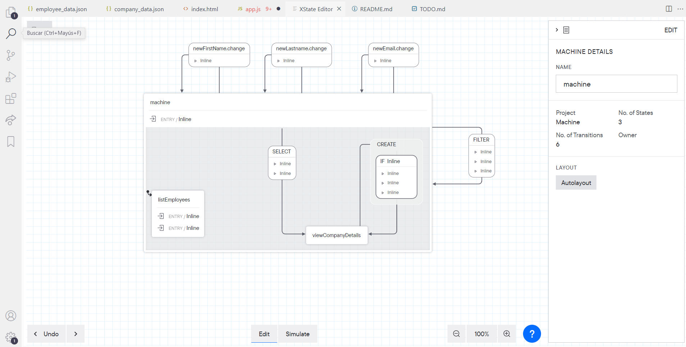

# Write a website using ~~JQuery~~ Javascript and Bootstrap (and Xstate)

## Instructions

```bash
npm install
npm start
```

1. [x] This application will pull data from employee_data.json and \
        company_data.json and build a view of all employees and companies.

2. [x] Users can search by employee's first or last name and filter by company name.

3. [x] On the main page, a list of all employees are displayed along with their \
        name, email, and company name. The company_id field maps the employee to a \
        company record in company_data.json.

4. [x] When the user taps the company name from the main page, a list of employees \
        associated with that company will be displayed on the company details page, \
        along with the contact name and email.

5. [x] (**Changed slighty to add when pressing + \
        Only can press + if entered new first name, last name and email \
        and in possible action for current state** ) \
        Users can also add an employee to a company by tapping \
        the + employee button on the company details page. \
        On this page, the user enters the employee's first name, last name, email, \
        and selects a company name from the drop down list.

6. [x] Company names are populated from company_data.json. \
        Upon tapping add, a json entry is created and printed in the console. \
        There is no API call to save the employee record in the database, \
        so printing the record will meet the requirement.

7. [x] BONUS (**Used Xstate to manage state and map posible actions and states**, \
        [autogenerated statechart for free](./xstate-extension-autogenerated-statechart.png))
       
       Company data and employee data is saved in a state management system
       (Redux, GetX, Bloc, or similar). \
        The save feature will save the employee in state and the main \
        page and company details page will reflect the newly created employee(s).
